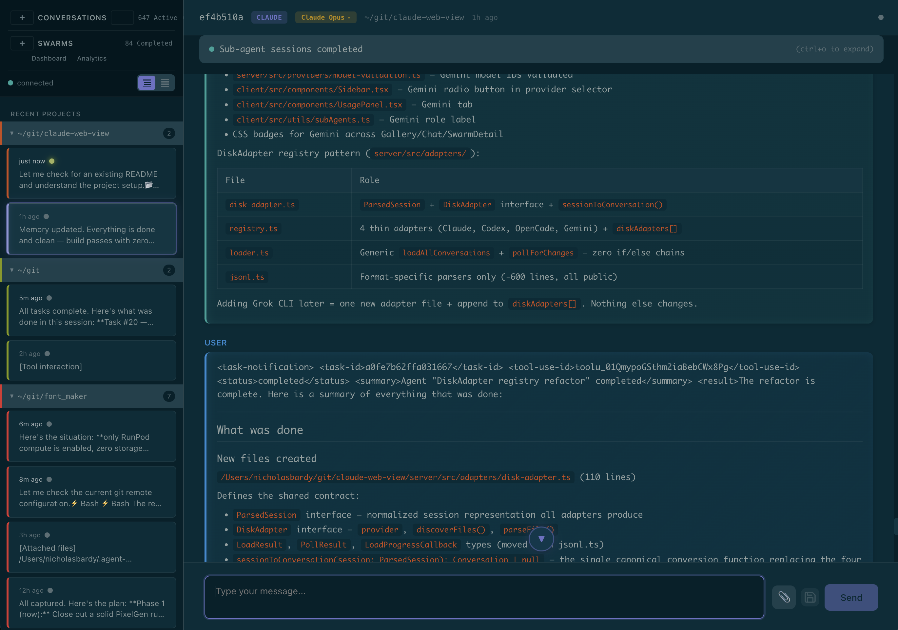
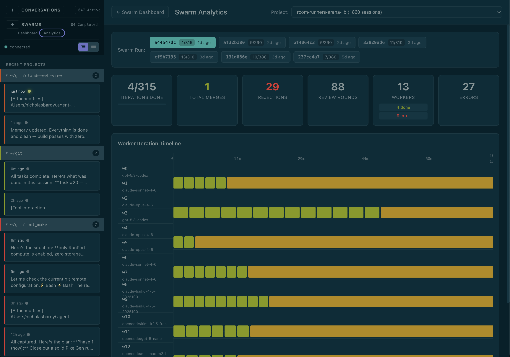

# Chocolate Factory

A web dashboard for your CLI coding agents. Reads conversations from Claude Code, Codex, OpenCode, and Gemini CLI — all in one place.



### Swarm Analytics

Track multi-agent swarm runs — iterations, merges, rejections, per-worker timelines.



## Quick Start

**Prerequisites:** [pnpm](https://pnpm.io/) and at least one supported CLI agent installed and authenticated (e.g. `claude`).

```bash
pnpm install
pnpm dev
```

Opens at [http://localhost:5173](http://localhost:5173) (client) with the API server on port 3000.

### Production

```bash
pnpm build
pnpm start     # serves built client + API on port 3000
```

## Supported Agents

| Agent | Disk path read | Live spawn |
|-------|---------------|------------|
| [Claude Code](https://docs.anthropic.com/en/docs/claude-code) | `~/.claude/projects/` | Yes |
| [Codex](https://github.com/openai/codex) | `~/.codex/sessions/` | Yes |
| [OpenCode](https://github.com/opencode-ai/opencode) | `~/.local/share/opencode/` | No (read-only) |
| [Gemini CLI](https://github.com/google-gemini/gemini-cli) | `~/.gemini/tmp/` | Yes |

The server auto-discovers conversations from each agent's disk format. No configuration needed — if the CLI has been used, its sessions show up.

## Project Structure

```
client/     React + Vite frontend
server/     Express + WebSocket backend
shared/     Shared types (Zod schemas)
```

## License

MIT
